  

 

I turn ideas into apps — **Flutter** on the front, **Python** for the brain, **FastAPI** for the glue.  
Currently obsessed with bringing AI into mobile experiences that actually feel magical.

 

*Open to collabs &nbsp;·&nbsp; Always building something*

---

<table>
<tr>
<td width="33%" align="center"> 📱  <b>Mobile First</b>  Cross-platform apps with Flutter & Dart — from wireframe to App Store, built to last.  </td>
<td width="33%" align="center"> 🤖  <b>AI / ML</b>  NLP, on-device models, recommendation systems — making apps feel like they think.  </td>
<td width="33%" align="center"> ⚙️  <b>Backend</b>  Clean APIs, real databases, deployed on AWS. FastAPI, Django — whatever the problem needs.  </td>
</tr>
</table>

---

### 🚧 What I'm building

> **[Project Name]** — One sentence that makes someone want to ask about it  
> Diving deep into **RAG pipelines** and **TFLite + Flutter** for on-device intelligence  
> Currently learning: *[something specific and real]*

---

  

---

### 🛠 Stack

&nbsp;&nbsp;&nbsp;&nbsp;**Mobile** &nbsp;&nbsp;&nbsp;&nbsp;&nbsp;&nbsp;&nbsp;&nbsp;&nbsp;&nbsp; Flutter &nbsp;·&nbsp; Dart  
&nbsp;&nbsp;&nbsp;&nbsp;**AI / ML** &nbsp;&nbsp;&nbsp;&nbsp;&nbsp;&nbsp;&nbsp;&nbsp;  Python &nbsp;·&nbsp; TensorFlow &nbsp;·&nbsp; scikit-learn  
&nbsp;&nbsp;&nbsp;&nbsp;**Backend** &nbsp;&nbsp;&nbsp;&nbsp;&nbsp;&nbsp;&nbsp; FastAPI &nbsp;·&nbsp; Django &nbsp;·&nbsp; PHP  
&nbsp;&nbsp;&nbsp;&nbsp;**Data** &nbsp;&nbsp;&nbsp;&nbsp;&nbsp;&nbsp;&nbsp;&nbsp;&nbsp;&nbsp;&nbsp;&nbsp;  MySQL &nbsp;·&nbsp; SQLite  
&nbsp;&nbsp;&nbsp;&nbsp;**Infra** &nbsp;&nbsp;&nbsp;&nbsp;&nbsp;&nbsp;&nbsp;&nbsp;&nbsp;&nbsp;&nbsp;&nbsp;  AWS &nbsp;·&nbsp; Docker &nbsp;·&nbsp; Linux  
&nbsp;&nbsp;&nbsp;&nbsp;**Also know** &nbsp;&nbsp;&nbsp;&nbsp; Java  

---

### 📌 Projects

<table>
<tr>
<td width="50%" align="center">

*Replace YOUR_REPO_1 with a real repo name*

</td>
<td width="50%" align="center">

*Replace YOUR_REPO_2 with a real repo name*

</td>
</tr>
</table>

---

### 📈 Activity

<picture>
  <source media="(prefers-color-scheme: dark)" srcset="https://raw.githubusercontent.com/K-S-King/K-S-King/output/github-contribution-grid-snake-dark.svg"/>
  
</picture>

---

 

